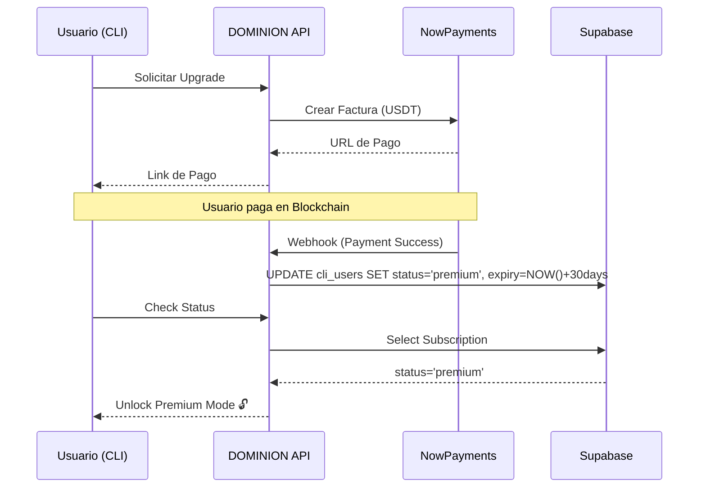

# 🧠 KR-CLI DOMINION: Arquitectura de Inteligencia

Este documento explica el flujo lógico de cómo DOMINION procesa las consultas, integra búsqueda web y genera respuestas seguras.

## 🔄 Flujo de Datos (Pipeline)

```mermaid
graph TD
    A[Usuario] -->|Consulta| B(CLI: Main Logic)
    B -->|Check| C{¿Web Search?}
    
    C -->|Si (ddgs instalado)| D[🔍 Búsqueda en DuckDuckGo]
    C -->|No| E[Omitir Búsqueda]
    
    D -->|Contexto Web| F[🛠️ Constructor de Prompt]
    E -->|Sin datos extra| F
    
    subgraph "Cliente (Tu PC/Termux)"
    B
    C
    D
    F
    G[Historial de Chat] --> F
    H[Info Sistema] --> F
    end
    
    F -->|JSON Seguro| I[☁️ API Server (Render)]
    
    subgraph "Servidor (DOMINION Core)"
    I -->|Validación| J{Auth & Créditos}
    J -->|OK| K[🔐 Inyección de System Prompt]
    K -->|Personalidad DOMINION| L[🤖 Modelo LLM (Groq/Llama3)]
    end
    
    L -->|Respuesta Generada| M[Respuesta API]
    M -->|JSON| B
    B -->|Renderizado Markdown| A
```

## 1. Captura de Contexto (Cliente)
Antes de enviar nada a la nube, el CLI local (`kalirootcli`) recopila información vital:
*   **Tu Entorno**: Detecta si usas Termux, Kali, permisos root, shell (Zsh/Bash).
*   **Historial**: Lee los últimos 8 mensajes de `chat_manager` para saber de qué estábamos hablando.
*   **Web Search**: Si tienes `ddgs` instalado, busca en tiempo real en internet sobre tu consulta y añade un resumen de los primeros resultados al contexto.

## 2. El Cerebro (Server)
El servidor (`api_server.py`) recibe tu consulta "cruda" y la transforma:
*   **System Prompt**: Inyecta la personalidad **DOMINION** (creado por Sebastian Lara).
*   **Reglas de Seguridad**: Añade instrucciones ocultas para que la IA no revele sus secretos y proteja contra inyecciones maliciosas.
*   **Modo Operativo**: Decide si responder en modo `CONSULTA` (Free) o `OPERATIVO COMPLETO` (Premium).

## 3. Generación Ultra-Rápida
Usamos **Groq** como motor de inferencia, lo que permite generar respuestas complejas en milisegundos, dando la sensación de una conversación real y fluida.

## 💰 Sistema de Suscripción y Pagos

DOMINION utiliza un modelo híbrido Free/Premium gestionado centralmente en la base de datos (Supabase).

### Tabla `cli_users`
Esta es la fuente de verdad para el estado de cada usuario.

| Columna | Tipo | Descripción |
| :--- | :--- | :--- |
| `id` | uuid | Identificador único del usuario (vinculado a `auth.users`) |
| `email` | text | Correo electrónico verificado |
| `subscription_status` | text | Estado actual del plan (ver valores abajo) |
| `subscription_expiry_date` | timestamp | Fecha exacta de expiración del plan Premium |
| `credits` | integer | Saldo de créditos para uso de AI (Modelo Free) |

### Valores de Estado (`subscription_status`)

1.  **`free`** (Default)
    *   **Permisos**: Acceso básico, modo `CONSULTA`.
    *   **Límites**: Depende de los créditos recargables diariamente.
    *   **AI**: Respuestas teóricas, sin generación de scripts complejos.

2.  **`pending`**
    *   **Causa**: El usuario ha generado una factura de pago pero aún no se confirma en la blockchain/pasarela.
    *   **Comportamiento**: Se trata igual que `free` hasta la confirmación.

3.  **`premium`**
    *   **Activación**: Automática vía Webhook tras pago confirmado (USDT/Crypto).
    *   **Permisos**: Modo `OPERATIVO COMPLETO`.
    *   **AI**: Sin límites de complejidad, generación de código, herramientas ofensivas.
    *   **Validación**: El servidor verifica en cada petición:
        ```python
        is_active = (status == "premium") and (expiry_date > now())
        ```

### Flujo de Pago

